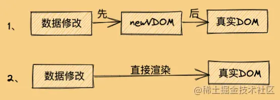

# Vue2.0基础篇

# Vue生命周期

| 生命周期          | 描述                                       |
| ------------- | ---------------------------------------- |
| beforeCreate  | 组件实例被创建之初，组件的属性生效之前，data 和 methods 中的数据还没有初始化 |
| created       | 组件实例已经完全创建，属性也绑定，最早能操作data、methods数据；但真是dom还没有生成，$el 还不可用 |
| beforeMount   | 在挂载开始之前被调用：相关的render函数首次被调用              |
| mounted       | el被新创建的vm.$el 替换，并挂载到实例上去之后调用该钩子；真实dom生成 |
| beforeUpdate  | 在数据发生改变后，DOM 被更新之前被调用。这里适合在现有DOM将要更新之前访问它，比如移除手动添加的事件监听器 |
| updated       | 组件数据更新之后                                 |
| beforeDestroy | 组件销毁前调用                                  |
| destoryed     | 组件销毁后调用                                  |
| activited     | keep-alive 专属，组件被激活时调用                   |
| deactivated   | keep-alive 专属，组件被销毁时调用                   |

# Vue-router 的实现和原理

## 什么是前端路由？

## 如何实现前端路由？

Vue-router 有两种模式：hash模式和history 模式。默认的路由模式是hash模式。

### hash实现

hash 模式是开发中默认的模式，它的URL带着一个#，例如http://www.abc.com/#/vue，它的hash值就是**#/vue**。

**特点：**hash值会出现在URL里面，但是不会出现在HTTP请求中，对后端完全没有影响。（在#后面出现的任何字符，都会被浏览器解读为位置标识符，这意味着，这些字符都不会被发送到服务器端。）所以改变hash值，不会重新加载页面。这种模式的浏览器支持度很好，低版本的IE浏览器也支持这种模式，hash路由被称为是前端路由，已经成为SPA（单页面应用）的标配。

**原理：**hash模式的主要原理就是 **onhashchange()** 事件

```js
window.onhashchange = function(event){
	console.log(event.oldURL, event.newURL);
	let hash = location.hash.slice(1);
}
```

使用onhashchange( ) 事件的好处就是，在页面的hash值发生变化时，无需向后端发起请求，window就可以监听事件的改变，并按规则加载相应的代码。除此之外，hash值变化对应的URL都会被浏览器记录下来，这样浏览器就能实现页面的前进和后退。虽然是没有请求后端服务器，但是页面的hash值和对应的URL关联起来了。

### history模式

history模式的URL中没有#，它使用的是传统的路由分发模式，即用户在输入一个URL时，服务器会接受这个请求，并解析这个URL，然后做出相应的逻辑处理。

**特点：**当使用history模式时，URL就像这样：http://abc.com/user/id。相比hash模式更加好看。但是，history模式需要后台配置支持，如果后台没有正确配置，访问时会返回404。

**API：** history api可以分为两大部分，切换历史状态和修改历史状态：

- **修改历史状态：**包括了 HTML5 History Interface 中新增的**pushState()** 和 replaceState() 方法，这两个方法应用于与浏览器的历史记录栈，提供了对历史记录进行修改的功能。只是当他们进行修改时，虽然修改了url，但浏览器不会立即向后端发送请求。如果要做到改变url但又不刷新页面的效果，就需要前端用上这两个API。
- **切换历史状态：**包括foward()、back()、go()三个方法，对应浏览器的前进、后退、跳转操作。

虽然history模式丢弃了丑陋的#。但是，它也有自己的缺点，就是在刷新页面的时候，如果没有相应的路由或资源，就会刷出404来。

如果想要切换到history模式，就要进行以下配置（后端也要进行配置）：

```js
const router = new VueRouter({
  mode: 'history',
  routes: [...]
})
```

### 两种模式对比

- pushState() 设置的新URL可以是与当前URL同源的任意URL；而hash只可修改 # 后面的部分，因此只能设置与当前URL同文档的URL。
- pushState() 设置的新URL可以与当前URL一模一样，这样也会把记录添加到栈中，而hash设置的新值必须与原来的不一样才会触发动作将记录添加到栈中。
- pushState() 通过stateObject 参数可以添加任意类型的数据到记录中；而hash只可添加短字符串。
- pushState() 可额外设置title属性供后续使用。
- hash模式下，仅hash符号之前的url会被包含在请求中，后端如果没有做到对路由的全覆盖，也不会返回404错误；
- history模式下，前端的url必须和实际向后端发起请求的url一致，如果没有对用的路由处理，将返回404错误。

hash模式和history模式都有各自的优势和缺陷，还是要根据实际情况选择性的使用。

## 如何获取页面的hash变化

**(1) 监听$route的变化**

```js
//监听，当路由发生变化的时候执行
watch:{
    $route:{
        handler:function(val,oldVal){
            console.log(val)
        },
        //深度监听
        deep:true
    }
}
```

**(2) window.location.hash读取#值**

window.location.hash 的值可读可写，读取来判断状态是否改变，写入时可以在不重载网页的前提下，添加一条历史访问记录。

下面是一个截图例子  $route在变化的时候我们能拿到一个对象，window.location.hash可以拿到当前的路由值


# 响应式核心原理

## Vue2

Vue2通过Object.defineProperty 的 **getter/setter** 对收集的依赖项进行监听，在属性被访问和修改时通知变化，进而更新视图数据。


## Object.defineProperty

Object.defineProperty 方法会直接在一个**对象上**定义一个**新属性**，或者**修改一个对象的现有属性**，并返回此对象。

Object.defineProperty(obj,prop,descriptor)

- obj  要定义属性的对象。
- prop  要定义或修改的属性的名称或Symbol。
- descriptor  要定义或修改的属性描述符。

```js
// 响应式函数
function defineReactive(obj, key, val) {
    Object.defineProperty(obj, key, {
        get() {
            console.log(`访问了${key}属性`)
            return val
        },
        set(newValue) {
            console.log(`将${key}由->${val}->设置成->${newValue}`)
            if (val == newValue) {
                return;
            }
            val = newValue
        }
    })
}


const data = {
    name: 'Tom',
    age: 3
}

const observe = function(data) {
    for (let key in data) {
        defineReactive(data, key, data[key])
    };
}

observe(data);

console.log(data.name)
// 访问了name属性
// Tom
data.name = 'Jerry' // 将name由->Tom->设置成->Jerry
console.log(data.name)
  // 访问了name属性
  // Jerry

```

## Vue2响应式的缺陷

- vue2的响应式是基于 Object.defineProperty 实现的，
  - Vue2的第一个缺陷，无法监听数组变化。由于JS的限制，Vue2不能检测以下数组的变动：
    - 当你利用索引直接设置一个数组项时，例如：vm.items[index] = newValue;
    - 当你修改数组的长度时，例如：vm.items.length = newLength;
  - Vue2的第二个缺陷，实现对象的深度监听，需要一次性递归到底。对于层级比较深的数据来说，计算量比较大。无法监听新增属性/删除属性，这也是为什么Vue2中对象新增属性需要使用**Vue.set()**,删除属性需要使用**Vue.delete()**
- Vue3的响应式是基于ES6的Proxy来实现的
  - Proxy 可以劫持整个对象，并返回一个新的对象
  - Proxy 不仅可以代理对象，还可以代理数组，还可以代理动态增加的属性
- Object.defineProperty 本身是可以监听到利用索引直接设置值时的变化，但是 尤大大 考虑到性能代价和用户体验收益不成正比，所以做了限制，通过重写push、pop、shift、unshift、sort、reverse、splice 方法，来实现数组的响应式。

# 虚拟DOM

## 真实DOM和其解析流程

所有的浏览器渲染引擎工作流程大致分为5步：创建 `DOM` 树 —> 构建 `CSSOM` -> 构建 `Render` 树 —> 布局 `Layout` -—> 绘制 `Painting`。

第一步，构建 DOM 树：用 HTML 分析器，分析 HTML 元素，构建一棵 DOM 树；

第二步，构建 CSSOM 树：用 CSS 分析器，分析 CSS 文件和元素上的 inline 样式，构建CSSOM树；

第三步，构建 Render 树：将 DOM 树和 CSSOM 关联起来，构建一棵 Render 树（Attachment）。每个 DOM 节点都有 attach 方法，接受样式信息，返回一个 render 对象（又名 renderer），这些 render 对象最终会被构建成一棵 Render 树；

第四步，布局：根据 Render 树结构，为每个 Render 树上的节点确定一个在显示屏上出现的精确坐标；

第五步，绘制页面：根据 Render 树和节点显示坐标，然后调用每个节点的 paint 方法，将它们绘制出来。

**注意点：**

原生 `JS` 或 `JQ` 操作 `DOM` 时，浏览器会从构建 DOM 树开始从头到尾执行一遍流程。在一次操作中，我需要更新 10 个 `DOM` 节点，浏览器收到第一个 `DOM` 请求后并不知道还有 9 次更新操作，因此会马上执行流程，最终执行10 次。例如，第一次计算完，紧接着下一个 `DOM` 更新请求，这个节点的坐标值就变了，前一次计算为无用功。计算 `DOM` 节点坐标值等都是白白浪费的性能。即使计算机硬件一直在迭代更新，操作 `DOM` 的代价仍旧是昂贵的，频繁操作还是会出现页面卡顿，影响用户体验

## 虚拟DOM基础

### 2.1虚拟Dom的好处

虚拟DOM 就是为了解决浏览器性能问题而被设计出来的。如前面，若一次操作中有 10 次更新 `DOM` 的动作，虚拟 `DOM` 不会立即操作 `DOM`，而是将这 10 次更新的 `diff` 内容保存到本地一个 `JS` 对象中，最终将这个 `JS` 对象一次性 `attch` 到 `DOM` 树上，再进行后续操作，避免大量无谓的计算量。所以，用 `JS` 对象模拟 `DOM` 节点的好处是，页面的更新可以先全部反映在 `JS` 对象(虚拟 `DOM` )上，操作内存中的 `JS` 对象的速度显然要更快，等更新完成后，再将最终的 `JS` 对象映射成真实的 `DOM`，交由浏览器去绘制。

我们先看一下，虚拟DOM是一个对象，一个用来表示真实DOM的对象。

我们可以看一下，以下是真实DOM

```js
<ul id="list">
    <li class="item">哈哈</li>
    <li class="item">呵呵</li>
    <li class="item">嘿嘿</li>
</ul>
```

对应的 虚拟DOM 为：

```js
let oldVDOM = { // 旧虚拟DOM
        tagName: 'ul', // 标签名
        props: { // 标签属性
            id: 'list'
        },
        children: [ // 标签子节点
            {
                tagName: 'li', props: { class: 'item' }, children: ['哈哈']
            },
            {
                tagName: 'li', props: { class: 'item' }, children: ['呵呵']
            },
            {
                tagName: 'li', props: { class: 'item' }, children: ['嘿嘿']
            },
        ]
    }
```

这时候，我修改一个 li标签 的文本：

```js
<ul id="list">
    <li class="item">哈哈</li>
    <li class="item">呵呵</li>
    <li class="item">可可爱爱</li> // 修改
</ul>
```

这个时候生成的 新虚拟DOM 为：

```js
let newVDOM = { // 新虚拟DOM
        tagName: 'ul', // 标签名
        props: { // 标签属性
            id: 'list'
        },
        children: [ // 标签子节点
            {
                tagName: 'li', props: { class: 'item' }, children: ['哈哈']
            },
            {
                tagName: 'li', props: { class: 'item' }, children: ['呵呵']
            },
            {
                tagName: 'li', props: { class: 'item' }, children: ['可可爱爱']
            },
        ]
    }
```

这就是咱们平常说的 **新旧两个虚拟DOM** ，这个时候的 `新虚拟DOM`是数据的最新状态，那么我们直接拿 `新虚拟DOM`去渲染成 `真实DOM`的话，效率真的会比直接操作真实DOM高吗？那肯定是不会的，看下图：



我们从上图可以看到，第二种方式比较快，因为第一种方式中间还夹着一个 虚拟DOM 的步骤，所以呢**虚拟DOM比真实DOM快** 这句话其实是错的，或者可以说是不严谨。

正确的说法应该是，**虚拟DOM算法操作真实DOM，性能高于直接操作真实DOM，虚拟DOM和虚拟DOM算法是两种概念。**

**虚拟DOM算法 = 虚拟DOM + Diff算法。**

## diff算法

diff 算法是一种对比算法，对比的双方是旧虚拟DOM和新虚拟DOM，对比出是哪个虚拟节点发生变化，找出这个虚拟节点，并只更新这个虚拟节点所对应的真实节点，而不用更新其它数据没发生改变的节点，实现 **精准地** 更新真实DOM，进而提高效率。

`使用虚拟DOM算法的损耗计算`： 总损耗 = 虚拟DOM增删改+（与Diff算法效率有关）真实DOM **差异** 增删改+（较少的节点）排版与重绘

`直接操作真实DOM的损耗计算`： 总损耗 = 真实DOM**完全**增删改+（可能较多的节点）排版与重绘

## diff算法的原理

### 同层对比

新旧虚拟DOM对比的时候，Diff算法只会在同层级进行，不会跨层级比较。所以Diff算法是：深度优先算法。时间复杂度：O（n）


## diff对比流程

当数据改变时，会触发**setter**，并且通过**Dep.notify**去通知所有订阅者**watcher**,订阅者们就会调用**patch**方法，给真实DOM**打补丁**，更新相应的视图。


### patch 方法

这个方法作用就是，对比当前同层的虚拟节点是否为同一种类型的标签 ：

* 是：继续执行 `patchVnode方法`进行深层比对
* 否：没必要比对了，直接整个节点替换成 `新虚拟节点`

```js
function patch(oldVnode, newVnode) {
  // 比较是否为一个类型的节点
  if (sameVnode(oldVnode, newVnode)) {
    // 是：继续进行深层比较
    patchVnode(oldVnode, newVnode)
  } else {
    // 否
    const oldEl = oldVnode.el // 旧虚拟节点的真实DOM节点
    const parentEle = api.parentNode(oldEl) // 获取父节点
    createEle(newVnode) // 创建新虚拟节点对应的真实DOM节点
    if (parentEle !== null) {
      api.insertBefore(parentEle, vnode.el, api.nextSibling(oEl)) // 将新元素添加进父元素
      api.removeChild(parentEle, oldVnode.el)  // 移除以前的旧元素节点
      // 设置null，释放内存
      oldVnode = null
    }
  }
  return newVnode
}
```

### sameVnode方法

patch关键的一步就是 `sameVnode方法判断是否为同一类型节点`，那问题来了，怎么才算是同一类型节点呢？这个 `类型`的标准是什么呢？

咱们来看看sameVnode方法的核心原理代码，就一目了然了

```js
function sameVnode(oldVnode, newVnode) {
  return (
    oldVnode.key === newVnode.key && // key值是否一样
    oldVnode.tagName === newVnode.tagName && // 标签名是否一样
    oldVnode.isComment === newVnode.isComment && // 是否都为注释节点
    isDef(oldVnode.data) === isDef(newVnode.data) && // 是否都定义了data
    sameInputType(oldVnode, newVnode) // 当标签为input时，type必须是否相同
  )
}
```

### patchVnode方法

这个函数做了以下事情：

* 找到对应的 `真实DOM`，称为 `el`
* 判断 `newVnode`和 `oldVnode`是否指向同一个对象，如果是，那么直接 `return`
* 如果他们都有文本节点并且不相等，那么将 `el`的文本节点设置为 `newVnode`的文本节点。
* 如果 `oldVnode`有子节点而 `newVnode`没有，则删除 `el`的子节点
* 如果 `oldVnode`没有子节点而 `newVnode`有，则将 `newVnode`的子节点真实化之后添加到 `el`
* 如果两者都有子节点，则执行 **`updateChildren`** 函数比较子节点，这一步很重要

```js
function patchVnode(oldVnode, newVnode) {
  const el = newVnode.el = oldVnode.el // 获取真实DOM对象
  // 获取新旧虚拟节点的子节点数组
  const oldCh = oldVnode.children, newCh = newVnode.children
  // 如果新旧虚拟节点是同一个对象，则终止
  if (oldVnode === newVnode) return
  // 如果新旧虚拟节点是文本节点，且文本不一样
  if (oldVnode.text !== null && newVnode.text !== null && oldVnode.text !== newVnode.text) {
    // 则直接将真实DOM中文本更新为新虚拟节点的文本
    api.setTextContent(el, newVnode.text)
  } else {
    // 否则

    if (oldCh && newCh && oldCh !== newCh) {
      // 新旧虚拟节点都有子节点，且子节点不一样

    // 对比子节点，并更新
      updateChildren(el, oldCh, newCh)
    } else if (newCh) {
      // 新虚拟节点有子节点，旧虚拟节点没有
      // 创建新虚拟节点的子节点，并更新到真实DOM上去
      createEle(newVnode)
    } else if (oldCh) {
      // 旧虚拟节点有子节点，新虚拟节点没有
      //直接删除真实DOM里对应的子节点
      api.removeChild(el)
    }
  }
}
```

### updateChildren方法

这是 `patchVnode`里最重要的一个方法，新旧虚拟节点的子节点对比，就是发生在 `updateChildren方法`中，

是怎么样一个对比方法呢？就是 `首尾指针法`，新的子节点集合和旧的子节点集合，各有首尾两个指针，举个例子：

我们来看一个例子：

```html
<ul>
    <li>a</li>
    <li>b</li>
    <li>c</li>
</ul>
修改数据后
<ul>
    <li>b</li>
    <li>c</li>
    <li>e</li>
    <li>a</li>
</ul>
```

通过图解的方式我们来看一下整个过程！

那么新旧两个子节点集合以及其首尾指针为：


然后会进行互相进行比较，总共有五种比较情况：

* 1、`oldS 和 newS `使用 `sameVnode方法`进行比较，`sameVnode(oldS, newS)`
* 2、`oldS 和 newE `使用 `sameVnode方法`进行比较，`sameVnode(oldS, newE)`
* 3、`oldE 和 newS `使用 `sameVnode方法`进行比较，`sameVnode(oldE, newS)`
* 4、`oldE 和 newE `使用 `sameVnode方法`进行比较，`sameVnode(oldE, newE)`
* 5、如果以上逻辑都匹配不到，再把所有旧子节点的 `key` 做一个映射到旧节点下标的 `key -> index` 表，然后用新 `vnode` 的 `key` 去找出在旧节点中可以复用的位置。


**接下来就以上面代码为例，分析一下比较的过程**

分析之前，请大家记住一点，最终的渲染结果都要以newVDOM为准，这也解释了为什么之后的节点移动需要移动到newVDOM所对应的位置


#### 第一步

```js
oldS = a, oldE = c
newS = b, newE = a
```

比较结果：`oldS 和 newE` 相等，需要把 `节点a`移动到 `newE`所对应的位置，也就是末尾，同时 `oldS++`，`newE--`


#### 第二步

```js
oldS = b, oldE = c
newS = b, newE = e
复制代码
```

比较结果：`oldS 和 newS`相等，需要把 `节点b`移动到 `newS`所对应的位置，同时 `oldS++`,`newS++`


#### 第三步

```js
oldS = c, oldE = c
newS = c, newE = e
复制代码
```

比较结果：`oldS、oldE 和 newS`相等，需要把 `节点c`移动到 `newS`所对应的位置，同时 `oldS++`,`newS++`


#### 第四步

`oldS > oldE`，则 `oldCh`先遍历完成了，而 `newCh`还没遍历完，说明 `newCh比oldCh多`，所以需要将多出来的节点，插入到真实DOM上对应的位置上


假如相反，是 `oldCh比newCh多`的话，那就是 `newCh`先走完循环，然后 `oldCh`会有多出的节点，结果会在真实DOM里进行删除这些旧节点。

### 用index做key

v-for 渲染的时候，为什么不建议用index作为循环项的key呢？

举个例子,如果我们把左边的初始数据，变成右边的列表

```html
<ul>                      <ul>
    <li key="0">a</li>        <li key="0">林三心</li>
    <li key="1">b</li>        <li key="1">a</li>
    <li key="2">c</li>        <li key="2">b</li>
                              <li key="3">c</li>
</ul>                     </ul>

```

按理说，最理想的结果是：只插入一个li标签新节点，其他都不动，确保操作DOM效率最高。

但是我们这里用了index来当key的话，按理说，`a，b，c`三个li标签都是复用之前的，因为他们三个根本没改变，改变的只是前面新增了一个`林三心`


但是我们前面说了，在进行子节点的 `diff算法` 过程中，会进行 旧首节点和新首节点的`sameNode`对比，这一步命中了逻辑，**因为现在`新旧两次首部节点` 的 `key` 都是 `0`了**，同理，key为1和2的也是命中了逻辑，导致`相同key的节点`会去进行`patchVnode`更新文本，而原本就有的`c节点`，却因为之前没有key为4的节点，而被当做了新节点，所以很搞笑，使用index做key，最后新增的居然是本来就已有的c节点。所以前三个都进行`patchVnode`更新文本，最后一个进行了`新增`，那就解释了为什么所有li标签都更新了。

以index为key的节点0，1，2一样了！！！就会更新里面的文本，但是实际上以index为key 并没有节省性能，我们以 唯一 的id或者其他唯一属性作为key值，这样key相同代表节点相同便可以复用。

# vue-ssr

## 什么是服务器端渲染 (SSR)？

Vue.js 是构建客户端应用程序的框架。默认情况下，可以在浏览器中输出 Vue 组件，进行 生成 DOM 和操作 DOM。然而，也可以将同一个组件渲染为服务器端的 HTML 字符串，将它们直接发送到浏览器，最后将这些静态标记"激活"为客户端上完全可交互的应用程序。

服务器渲染的 Vue.js 应用程序也可以被认为是"同构"或"通用"，因为应用程序的大部分代码都可以在**服务器**和**客户端**上运行。

## 为什么使用服务器端渲染 (SSR)？

与传统 SPA (单页应用程序 (Single-Page Application)) 相比，服务器端渲染 (SSR) 的优势主要在于：

-   更好的 SEO，由于搜索引擎爬虫抓取工具可以直接查看完全渲染的页面。
-   更快的内容到达时间 (time-to-content)，特别是对于缓慢的网络情况或运行缓慢的设备。无需等待所有的 JavaScript 都完成下载并执行，才显示服务器渲染的标记，所以你的用户将会更快速地看到完整渲染的页面。通常可以产生更好的用户体验，并且对于那些「内容到达时间(time-to-content) 与转化率直接相关」的应用程序而言，服务器端渲染 (SSR) 至关重要。

使用服务器端渲染 (SSR) 时还需要有一些权衡之处：

-   开发条件所限。浏览器特定的代码，只能在某些生命周期钩子函数 (`beforeCreate`、`created`) 中使用；一些外部扩展库 (external library) 可能需要特殊处理，才能在服务器渲染应用程序中运行。
-   涉及构建设置和部署的更多要求。与可以部署在任何静态文件服务器上的完全静态单页面应用程序 (SPA) 不同，服务器渲染应用程序，需要处于 Node.js server 运行环境。
-   更多的服务器端负载。在 Node.js 中渲染完整的应用程序，显然会比仅仅提供静态文件的 server 更加大量占用 CPU 资源 (CPU-intensive - CPU 密集)，因此如果你预料在高流量环境 (high traffic) 下使用，请准备相应的服务器负载，并明智地采用缓存策略

## 服务器端渲染 vs 预渲染 (SSR vs Prerendering)

如果你调研服务器端渲染 (SSR) 只是用来改善少数营销页面（例如 `/`, `/about`, `/contact` 等）的 SEO，那么你可能需要**预渲染**。无需使用 web 服务器实时动态编译 HTML，而是使用预渲染方式，在构建时 (build time) 简单地生成针对特定路由的静态 HTML 文件。优点是设置预渲染更简单，并可以将你的前端作为一个完全静态的站点。

如果你使用 webpack，你可以使用 [prerender-spa-plugin](https://github.com/chrisvfritz/prerender-spa-plugin) 轻松地添加预渲染。它已经被 Vue 应用程序广泛测试 - 事实上，[作者](https://github.com/chrisvfritz)是 Vue 核心团队的成员。

# Vuex 使用

## State

### 单一状态树

Vuex 使用**单一状态树**——是的，用一个对象就包含了全部的应用层级状态。至此它便作为一个“唯一数据源 ([SSOT](https://en.wikipedia.org/wiki/Single_source_of_truth))”而存在。这也意味着，每个应用将仅仅包含一个 store 实例。单一状态树让我们能够直接地定位任一特定的状态片段，在调试的过程中也能轻易地取得整个当前应用状态的快照。

### 在 Vue 组件中获得 Vuex 状态

由于 Vuex 的状态存储是响应式的，从 store 实例中读取状态最简单的方法就是在[计算属性 (opens new window)](https://cn.vuejs.org/guide/computed.html)中返回某个状态：

```js
// 创建一个 Counter 组件
const Counter = {
  template: `<div>{{ count }}</div>`,
  computed: {
    count () {
      return store.state.count
    }
  }
}
```

每当 `store.state.count` 变化的时候, 都会重新求取计算属性，并且触发更新相关联的 DOM

然而，这种模式导致组件依赖全局状态单例。在模块化的构建系统中，在每个需要使用 state 的组件中需要频繁地导入，并且在测试组件时需要模拟状态。

Vuex 通过 `store` 选项，提供了一种机制将状态从根组件“注入”到每一个子组件中（需调用 `Vue.use(Vuex)`）：

```js
const app = new Vue({
  el: '#app',
  // 把 store 对象提供给 “store” 选项，这可以把 store 的实例注入所有的子组件
  store,
  components: { Counter },
  template: `
    <div class="app">
      <counter></counter>
    </div>
  `
})
```

**通过在根实例中注册 `store` 选项，该 store 实例会注入到根组件下的所有子组件中，且子组件能通过 `this.$store` 访问到**。让我们更新下 `Counter` 的实现：

```js
const Counter = {
  template: `<div>{{ count }}</div>`,
  computed: {
    count () {
      return this.$store.state.count
    }
  }
}
```

### mapState 辅助函数

当一个组件需要获取多个状态的时候，将这些状态都声明为计算属性会有些重复和冗余。为了解决这个问题，我们可以使用 `mapState` 辅助函数帮助我们生成计算属性，让你少按几次键。

`mapState` 函数返回的是一个对象。我们如何将它与局部计算属性混合使用呢？通常，我们需要使用一个工具函数将多个对象合并为一个，以使我们可以将最终对象传给 `computed` 属性。但是自从有了[对象展开运算符](https://github.com/tc39/proposal-object-rest-spread)，我们可以极大地简化写法：

```js
// 在单独构建的版本中辅助函数为 Vuex.mapState
import { mapState } from 'vuex'

export default {
  // ...
  computed: {
      // 使用对象展开运算符将此对象混入到外部对象中
    ...mapState({
        // 箭头函数可使代码更简练
        count: state => state.count,

        // 传字符串参数 'count' 等同于 `state => state.count`
        countAlias: 'count',

        // 为了能够使用 `this` 获取局部状态，必须使用常规函数
        countPlusLocalState (state) {
          return state.count + this.localCount
        }
 	})
  }
}
```

当映射的计算属性的名称与 state 的子节点名称相同时，我们也可以给 `mapState` 传一个字符串数组。

```js
computed: {
	...mapState([
      // 映射 this.count 为 store.state.count
      'count'
    ])
}
```

### 组件仍然保有局部状态

使用 Vuex 并不意味着你需要将**所有的**状态放入 Vuex。虽然将所有的状态放到 Vuex 会使状态变化更显式和易调试，但也会使代码变得冗长和不直观。如果有些状态严格属于单个组件，最好还是作为组件的局部状态。你应该根据你的应用开发需要进行权衡和确定。

## Getters

-   有时候我们需要从 store 中的 state 中派生出一些状态，Vuex 允许我们在 store 中定义“getter”（可以认为是 store 的计算属性）。就像计算属性一样，getter 的返回值会根据它的依赖被缓存起来，且只有当它的依赖值发生了改变才会被重新计算。
-   Getter 接受 state 作为其第一个参数。

### 通过属性访问

-   Getter 会暴露为 `store.getters` 对象，你可以以属性的形式访问这些值：`store.getters.doneTodos`
-   Getter 也可以接受其他 getter 作为第二个参数.

??? 注意，getter 在通过属性访问时是作为 Vue 的响应式系统的一部分缓存其中的。

### 通过方法访问

你也可以通过让 getter 返回一个函数，来实现给 getter 传参。在你对 store 里的数组进行查询时非常有用。

```js
getters: {
  // ...
  getTodoById: (state) => (id) => {
    return state.todos.find(todo => todo.id === id)
  }
}

store.getters.getTodoById(2) // -> { id: 2, text: '...', done: false }
```

**注意，getter 在通过方法访问时，每次都会去进行调用，而不会缓存结果。**

### `mapGetters` 辅助函数

`mapGetters` 辅助函数仅仅是将 store 中的 getter 映射到局部计算属性：

```js
import { mapGetters } from 'vuex'

export default {
  // ...
  computed: {
  // 使用对象展开运算符将 getter 混入 computed 对象中
    ...mapGetters([
        // 把 `this.doneCount` 映射为 `this.$store.getters.doneTodosCount`
  		doneCount: 'doneTodosCount',
        'anotherGetter'
      // ...
    ])
  }
}
```

## Mutation

更改 Vuex 的 store 中的状态的唯一方法是提交 mutation。调用 **store.commit** 方法

Vuex 中的 mutation 非常类似于事件：每个 mutation 都有一个字符串的 **事件类型 (type)** 和 一个 **回调函数 (handler)**。这个回调函数就是我们实际进行状态更改的地方，并且它会接受 state 作为第一个参数：

```js
const store = new Vuex.Store({
  state: {
    count: 1
  },
  mutations: {
    increment (state) {
      // 变更状态
      state.count++
    }
  }
})
```

要唤醒一个 mutation handler，你需要以相应的 type 调用 **store.commit** 方法：

```js
store.commit('increment')
```

### 提交方式

#### 载荷（payload）提交方式

向 `store.commit` 传入额外的参数，即 mutation 的 **载荷（payload）**，在大多数情况下，载荷应该是一个对象，这样可以包含多个字段并且记录的 mutation 会更易读

```js
mutations: {
  increment (state, n) {
    state.count += n
  }
}
store.commit('increment', 10)
```

```js
mutations: {
  increment (state, payload) {
    state.count += payload.amount
  }
}
store.commit('increment', {
  amount: 10
})
```

#### 对象风格的提交方式

提交 mutation 的另一种方式是直接使用包含 `type` 属性的对象：

```js
store.commit({
  type: 'increment',
  amount: 10
})
```

当使用对象风格的提交方式，整个对象都作为载荷传给 mutation 函数，因此 handler 保持不变：

```js
mutations: {
  increment (state, payload) {
    state.count += payload.amount
  }
}
```

### Mutation 需遵守 Vue 的响应规则

1.  最好提前在你的 store 中初始化好所有所需属性。
2.  当需要在对象上添加新属性时，你应该

-   使用 `Vue.set(obj, 'newProp', 123)`, 或者

-   以新对象替换老对象。例如，利用[对象展开运算符 (opens new window)](https://github.com/tc39/proposal-object-rest-spread)我们可以这样写：

    ```js
    state.obj = { ...state.obj, newProp: 123 }
    ```

### Mutation 必须是同步函数

一条重要的原则就是要记住 **mutation 必须是同步函数**。

现在想象，我们正在 debug 一个 app 并且观察 devtool 中的 mutation 日志。每一条 mutation 被记录，devtools 都需要捕捉到前一状态和后一状态的快照。然而，在上面的例子中 mutation 中的异步函数中的回调让这不可能完成：因为当 mutation 触发的时候，回调函数还没有被调用，devtools 不知道什么时候回调函数实际上被调用——实质上任何在回调函数中进行的状态的改变都是不可追踪的。

### 在组件中提交 Mutation

你可以在组件中使用 `this.$store.commit('xxx')` 提交 mutation，或者使用 `mapMutations` 辅助函数将组件中的 methods 映射为 `store.commit` 调用（需要在根节点注入 `store`）。

```js
import { mapMutations } from 'vuex'

export default {
  // ...
  methods: {
    ...mapMutations([
      'increment', // 将 `this.increment()` 映射为 `this.$store.commit('increment')`

      // `mapMutations` 也支持载荷：
      'incrementBy' // 将 `this.incrementBy(amount)` 映射为 `this.$store.commit('incrementBy', amount)`
    ]),
    ...mapMutations({
      add: 'increment' // 将 `this.add()` 映射为 `this.$store.commit('increment')`
    })
  }
}
```

## Action

Action 类似于 mutation，不同在于：

-   Action 提交的是 mutation，而不是直接变更状态。
-   Action 可以包含任意异步操作。

让我们来注册一个简单的 action：

```js
const store = new Vuex.Store({
  state: {
    count: 0
  },
  mutations: {
    increment (state) {
      state.count++
    }
  },
  actions: {
    increment (context) {
      context.commit('increment')
    }
  }
})
```

Action 函数接受一个与 store 实例具有相同方法和属性的 context 对象，因此你可以调用 `context.commit` 提交一个 mutation，或者通过 `context.state` 和 `context.getters` 来获取 state 和 getters。当我们在之后介绍到 [Modules](https://vuex.vuejs.org/zh/guide/modules.html) 时，你就知道 context 对象为什么不是 store 实例本身了。

实践中，我们会经常用到 ES2015 的 [参数解构 (opens new window)](https://github.com/lukehoban/es6features#destructuring)来简化代码（特别是我们需要调用 `commit` 很多次的时候）：

```js
actions: {
  // 解构取出 context 
  increment ({ commit }) {
    commit('increment')
  }
}
```

### 分发 Action

Action 通过 `store.dispatch` 方法触发：

```js
store.dispatch('increment')
```

Actions 支持同样的载荷方式和对象方式进行分发：

```js
// 以载荷形式分发
store.dispatch('incrementAsync', {
  amount: 10
})

// 以对象形式分发
store.dispatch({
  type: 'incrementAsync',
  amount: 10
})
```

来看一个更加实际的购物车示例，涉及到**调用异步 API** 和**分发多重 mutation**：

```js
actions: {
  checkout ({ commit, state }, products) {
    // 把当前购物车的物品备份起来
    const savedCartItems = [...state.cart.added]
    // 发出结账请求，然后乐观地清空购物车
    commit(types.CHECKOUT_REQUEST)
    // 购物 API 接受一个成功回调和一个失败回调
    shop.buyProducts(
      products,
      // 成功操作
      () => commit(types.CHECKOUT_SUCCESS),
      // 失败操作
      () => commit(types.CHECKOUT_FAILURE, savedCartItems)
    )
  }
}
```

### 在组件中分发Action

你在组件中使用 `this.$store.dispatch('xxx')` 分发 action，或者使用 `mapActions` 辅助函数将组件的 methods 映射为 `store.dispatch` 调用（需要先在根节点注入 `store`）：

```js
import { mapActions } from 'vuex'

export default {
  // ...
  methods: {
    ...mapActions([
      'increment', // 将 `this.increment()` 映射为 `this.$store.dispatch('increment')`

      // `mapActions` 也支持载荷：
      'incrementBy' // 将 `this.incrementBy(amount)` 映射为 `this.$store.dispatch('incrementBy', amount)`
    ]),
    ...mapActions({
      add: 'increment' // 将 `this.add()` 映射为 `this.$store.dispatch('increment')`
    })
  }
}
```

### 组合 Action

Action 通常是异步的，那么如何知道 action 什么时候结束呢？更重要的是，我们如何才能组合多个 action，以处理更加复杂的异步流程？

首先，你需要明白 `store.dispatch` 可以处理被触发的 action 的处理函数返回的 Promise，并且 `store.dispatch` 仍旧返回 Promise：

```js
actions: {
  actionA ({ commit }) {
    return new Promise((resolve, reject) => {
      setTimeout(() => {
        commit('someMutation')
        resolve()
      }, 1000)
    })
  }
}
```

现在你可以：

```js
store.dispatch('actionA').then(() => {
  // ...
})
```

在另外一个 action 中也可以：

```js
actions: {
  // ...
  actionB ({ dispatch, commit }) {
    return dispatch('actionA').then(() => {
      commit('someOtherMutation')
    })
  }
}
```

最后，如果我们利用 [async / await (opens new window)](https://tc39.github.io/ecmascript-asyncawait/)，我们可以如下组合 action：

```js
// 假设 getData() 和 getOtherData() 返回的是 Promise

actions: {
  async actionA ({ commit }) {
    commit('gotData', await getData())
  },
  async actionB ({ dispatch, commit }) {
    await dispatch('actionA') // 等待 actionA 完成
    commit('gotOtherData', await getOtherData())
  }
}
```

>   一个 `store.dispatch` 在不同模块中可以触发多个 action 函数。在这种情况下，只有当所有触发函数完成后，返回的 Promise 才会执行。

## Modules

由于使用单一状态树，应用的所有状态会集中到一个比较大的对象。当应用变得非常复杂时，store 对象就有可能变得相当臃肿。

为了解决以上问题，Vuex 允许我们将 store 分割成**模块（module）**。每个模块拥有自己的 state、mutation、action、getter、甚至是嵌套子模块——从上至下进行同样方式的分割：

```js
const moduleA = {
  state: () => ({ ... }),
  mutations: { ... },
  actions: { ... },
  getters: { ... }
}

const moduleB = {
  state: () => ({ ... }),
  mutations: { ... },
  actions: { ... }
}

const store = new Vuex.Store({
  modules: {
    a: moduleA,
    b: moduleB
  }
})

store.state.a // -> moduleA 的状态
store.state.b // -> moduleB 的状态
```

### 模块的局部状态

对于模块内部的 mutation 和 getter，接收的第一个参数是**模块的局部状态对象**。

```js
const moduleA = {
  state: () => ({
    count: 0
  }),
  mutations: {
    increment (state) {
      // 这里的 `state` 对象是模块的局部状态
      state.count++
    }
  },

  getters: {
    doubleCount (state) {
      return state.count * 2
    }
  }
}
```

同样，对于模块内部的 action，局部状态通过 `context.state` 暴露出来，根节点状态则为 `context.rootState`：

```js
const moduleA = {
  // ...
  actions: {
    incrementIfOddOnRootSum ({ state, commit, rootState }) {
      if ((state.count + rootState.count) % 2 === 1) {
        commit('increment')
      }
    }
  }
}
```

对于模块内部的 getter，根节点状态会作为第三个参数暴露出来：

```js
const moduleA = {
  // ...
  getters: {
    sumWithRootCount (state, getters, rootState) {
      return state.count + rootState.count
    }
  }
}
```

[Vuex](https://vuex.vuejs.org/zh/)

## Vuex 简易实现

[快速上手Vuex 到 手写简易 Vuex](https://juejin.cn/post/6994337441314242590)

[vuex 源码解析](https://liyucang-git.github.io/2019/07/21/vuex%E6%BA%90%E7%A0%81%E8%A7%A3%E6%9E%90/)

# Vuex 对比 Eventbus

## Eventbus 导致的问题

1.  代码逻辑性极具下降，可阅读性变低
2.  对于每一个action父组件都需要一个on(或dispatch)一个事件来处理
3.  你将很难查找到每一个事件是从哪里触发，满篇都是业务逻辑、

## Vuex

为了防止这些问题，这个时候，国王尤小右站了出来，他借助隔壁flux王国的思想，带领全国的智者研究出了一个新的方式来解决这种混乱的问题。那就是vuex了。

按照定义来说

1.  store是一个仓库，仓库保存着项目的数据(store.state)
2.  (严格模式)为了解决无法追踪状态变化的问题，仓库里的数据不直接通过修改store.state来改变，而是通过commit一个动作告诉仓库，将会报错 [vuex] Do not mutate vuex store state outside mutation handlers
3.  仓库收到了commit的动作后，将会在store.mutation里查找对应事件，并改变store.state

## 总结

通过长篇的分析我们可以得出本文结论了。

1.  vuex是官方推出的，事件总线是高手在民间
2.  在大型应用方面，vuex确实是一个比EventBus更好的解决方案
3.  vuex更加易于调试与管理
4.  Vuex并不是最佳的解决方案，在某些小型应用上，你可能只有小部分的数据交互，甚至只有一个登录状态储存，那样事件总线或者[简单状态管理](https://link.juejin.cn?target=https%3A%2F%2Fcn.vuejs.org%2Fv2%2Fguide%2Fstate-management.html%23%E7%AE%80%E5%8D%95%E7%8A%B6%E6%80%81%E7%AE%A1%E7%90%86%E8%B5%B7%E6%AD%A5%E4%BD%BF%E7%94%A8)都是值得推荐的。
    最后说一句，vuex真香。 ps:这只是笔者的见解，有什么问题欢迎大家踊跃提出指正。

# 面试常考

## 说说你对 SPA 单页面的理解，它的优缺点分别是什么？

SPA（ single-page application ）仅在 Web 页面初始化时加载相应的 HTML、JavaScript 和 CSS。一旦页面加载完成，SPA 不会因为用户的操作而进行页面的重新加载或跳转；取而代之的是利用路由机制实现 HTML 内容的变换，UI 与用户的交互，避免页面的重新加载。

**优点：**

-   用户体验好、快，内容的改变不需要重新加载整个页面，避免了不必要的跳转和重复渲染；
-   基于上面一点，SPA 相对对服务器压力小；
-   前后端职责分离，架构清晰，前端进行交互逻辑，后端负责数据处理；

**缺点：**

-   初次加载耗时多：为实现单页 Web 应用功能及显示效果，需要在加载页面的时候将 JavaScript、CSS 统一加载，部分页面按需加载；
-   前进后退路由管理：由于单页应用在一个页面中显示所有的内容，所以不能使用浏览器的前进后退功能，所有的页面切换需要自己建立堆栈管理；
-   SEO 难度较大：由于所有的内容都在一个页面中动态替换显示，所以在 SEO 上其有着天然的弱势。

## v-if 与 v-show 的区别

**v-if** 是**真正**的条件渲染，因为它会确保在切换过程中条件块内的事件监听器和子组件适当地被销毁和重建；也是**惰性的**：如果条件不成立不会渲染当前指令所在结点的 DOM 元素。

**v-show** 就简单得多——不管条件是什么，元素总是会被渲染，并且只是简单地基于 CSS 的 “display” 属性切换当前 DOM 的显示与隐藏。

`v-if`有更高的切换消耗，而`v-show`有更高的初始渲染消耗，所以，v-if 适用于在运行时很少改变条件，不需要频繁切换条件的场景；v-show 则适用于需要非常频繁切换条件的场景

### display:none和visibility:hidden的区别

**display: none**

我们都清楚当元素设置`display:none`后，界面上将不会显示该元素，并且该元素不占布局空间，但我们仍然可以通过JavaScript操作该元素。但为什么会这样呢？ 这个涉及到浏览器的渲染原理：浏览器会解析HTML标签生成DOM Tree，解析CSS生成CSSOM，然后将DOM Tree和CSSOM合成生成Render Tree，元素在Render Tree中对应0或多个盒子，然后浏览器以盒子模型的信息布局和渲染界面。**而设置为`display:none`的元素则在Render Tree中没有生成对应的盒子模型，因此后续的布局、渲染工作自然没它什么事了**，至于DOM操作还是可以的。

-   界面上将不会显示该元素，并且该元素不占布局空间；但是可以进行 DOM 操作
-   父元素为 `display: none`，子元素也难逃一劫
-   无法响应任何事件，无论是捕获、命中目标和冒泡阶段均不可以
-   不耽误form表单提交数据 虽然我们无法看到`display:none`的元素，但当表单提交时依然会将隐藏的input元素的值提交上去。
-   display变化时将触发reflow（回流）

**visibility:hidden**

-   让元素在界面上不可视，但保留元素原来占有的位置
-   父元素为`visibility:hidden`，而子元素可以设置为`visibility:visible`并且生效
-   可在冒泡阶段响应事件 由于设置为`visibility:hidden`的元素其子元素可以为`visibility:visible`，因此隐藏的元素有可能位于事件冒泡的路径上因此下面代码中，将鼠标移至`.visible`时，`.hidden`会响应`hover`事件显示。
-   和`display:none`一样不妨碍form表单的提交
-   visibility变化不会触发reflow 由于从visible设置为hidden时，不会改变元素布局相关的属性，因此不会触发reflow，只是静静地和其他渲染变化一起等待浏览器定时重绘界面

[CSS魔法堂：display:none与visibility:hidden的恩怨情仇](https://juejin.cn/post/6844903686313869320)

## 怎样理解 Vue 的单向数据流？

所有的 prop 都使得其父子 prop 之间形成了一个**单向下行绑定**：父级 prop 的更新会向下流动到子组件中，但是反过来则不行。这样会防止从子组件意外改变父级组件的状态，从而导致你的应用的数据流向难以理解。

额外的，每次父级组件发生更新时，子组件中所有的 prop 都将会刷新为最新的值。这意味着你不应该在一个子组件内部改变 prop。如果你这样做了，Vue 会在浏览器的控制台中发出警告。子组件想修改时，只能通过 $emit 派发一个自定义事件，父组件接收到后，由父组件修改。

有两种常见的试图改变一个 prop 的情形 :

-   **这个 prop 用来传递一个初始值；这个子组件接下来希望将其作为一个本地的 prop 数据来使用。** 在这种情况下，最好定义一个本地的 data 属性并将这个 prop 用作其初始值：

```vue
props: ['initialCounter'],
data: function () {
  return {
    counter: this.initialCounter
  }
}
```

-   **这个 prop 以一种原始的值传入且需要进行转换。** 在这种情况下，最好使用这个 prop 的值来定义一个计算属性

```vue
props: ['size'],
computed: {
  normalizedSize: function () {
    return this.size.trim().toLowerCase()
  }
}
```

## computed 和 watch 的区别和运用的场景？

**computed 原理**

1.  当组件初始化的时候，`computed` 和 `data` 会分别建立各自的响应系统，`Observer`遍历 `data` 中每个属性设置 `get/set` 数据拦截
2.  初始化 `computed`会调用 `initComputed`函数
    1.  注册一个 `watcher` 实例，并在内实例化一个 `Dep` 消息订阅器用作后续收集依赖（比如渲染函数的 `watcher` 或者其他观察该计算属性变化的 `watcher` ）
    2.  调用计算属性时会触发其`Object.defineProperty`的`get`访问器函数
    3.  调用 `watcher.depend()` 方法向自身的消息订阅器 `dep` 的 `subs` 中添加其他属性的 `watcher`
    4.  调用 `watcher` 的 `evaluate` 方法（进而调用 `watcher` 的 `get` 方法）让自身成为其他 `watcher` 的消息订阅器的订阅者，首先将 `watcher` 赋给 `Dep.target`，然后执行 `getter` 求值函数，当访问求值函数里面的属性（比如来自 `data`、`props` 或其他 `computed`）时，会同样触发它们的 `get` 访问器函数从而将该计算属性的 `watcher` 添加到求值函数中属性的 `watcher` 的消息订阅器 `dep` 中，当这些操作完成，最后关闭 `Dep.target` 赋为 `null` 并返回求值函数结果。
3.  当某个属性发生变化，触发 `set` 拦截函数，然后调用自身消息订阅器 `dep` 的 `notify` 方法，遍历当前 `dep` 中保存着所有订阅者 `wathcer` 的 `subs` 数组，并逐个调用 `watcher` 的  `update` 方法，完成响应更新。

**computed：** 是计算属性，依赖其它属性值，并且 computed 的值有缓存，只有它依赖的属性值发生改变，下一次获取 computed 的值时才会重新计算 computed  的值；

**watch：** 更多的是「观察」的作用，类似于某些数据的监听回调 ，每当监听的数据变化时都会执行回调进行后续操作；

**运用场景：**

-   当我们需要进行数值计算，并且依赖于其它数据时，应该使用 computed，因为可以利用 computed 的缓存特性，避免每次获取值时，都要重新计算；**computed主要用于对同步数据的处理**
-   当我们需要在数据变化时执行异步或开销较大的操作时，应该使用 watch，使用 watch 选项允许我们执行异步操作 ( 访问一个 API )，限制我们执行该操作的频率，并在我们得到最终结果前，设置中间状态。这些都是计算属性无法做到的。**watch则主要用于观测某个值的变化去完成一段开销较大的复杂业务逻辑**。

## 直接给一个数组项赋值，Vue 能检测到变化吗？

由于 JavaScript 的限制，Vue 不能检测到以下数组的变动：

-   当你利用索引直接设置一个数组项时，例如：`vm.items[indexOfItem] = newValue`
-   当你修改数组的长度时，例如：`vm.items.length = newLength`

为了解决第一个问题，Vue 提供了以下操作方法：

```js
// Vue.set
Vue.set(vm.items, indexOfItem, newValue)
// vm.$set，Vue.set的一个别名
vm.$set(vm.items, indexOfItem, newValue)
// Array.prototype.splice
vm.items.splice(indexOfItem, 1, newValue)
```

为了解决第二个问题，Vue 提供了以下操作方法：

```js
// Array.prototype.splice
vm.items.splice(newLength)
```

## 谈谈你对 Vue 生命周期的理解？

**（1）生命周期是什么？**

Vue 实例有一个完整的生命周期，也就是从开始创建、初始化数据、编译模版、挂载 Dom -> 渲染、更新 -> 渲染、卸载等一系列过程，我们称这是 Vue 的生命周期。

**（2）各个生命周期的作用**

| 生命周期          | 描述                                       |
| ------------- | ---------------------------------------- |
| beforeCreate  | 组件实例被创建之初，组件的属性生效之前，data 和 methods 中的数据还没有初始化 |
| created       | 组件实例已经完全创建，属性也绑定，最早能操作data、methods数据；但真实 dom 还没有生成，$el 还不可用 |
| beforeMount   | 在挂载开始之前被调用：相关的 render 函数首次被调用            |
| mounted       | el 被新创建的 vm.$el 替换，并挂载到实例上去之后调用该钩子；真实 dom 生成 |
| beforeUpdate  | 在数据发生改变后，DOM 被更新之前被调用。这里适合在现有 DOM 将要被更新之前访问它，比如移除手动添加的事件监听器。 |
| update        | 组件数据更新之后                                 |
| activited     | keep-alive 专属，组件被激活时调用                   |
| deactivated   | keep-alive 专属，组件被销毁时调用                   |
| beforeDestory | 组件销毁前调用                                  |
| destoryed     | 组件销毁后调用                                  |


## Vue 的父组件和子组件生命周期钩子函数执行顺序？

Vue 的父组件和子组件生命周期钩子函数执行顺序可以归类为以下 4 部分：

-   加载渲染过程

    父 beforeCreate -> 父 created -> 父 beforeMount -> 子 beforeCreate -> 子 created -> 子 beforeMount -> 子 mounted -> 父 mounted

-   子组件更新过程

    父 beforeUpdate -> 子 beforeUpdate -> 子 updated -> 父 updated

-   父组件更新过程

    父 beforeUpdate -> 父 updated

-   销毁过程

    父 beforeDestroy -> 子 beforeDestroy -> 子 destroyed -> 父 destroyed

## 父组件可以监听到子组件的生命周期吗？

比如有父组件 Parent 和子组件 Child，如果父组件监听到子组件挂载 mounted 就做一些逻辑处理，可以通过以下写法实现：

```
// Parent.vue
<Child @mounted="doSomething"/>
    
// Child.vue
mounted() {
  this.$emit("mounted");
}
复制代码

```

以上需要手动通过 $emit 触发父组件的事件，更简单的方式可以在父组件引用子组件时通过 @hook 来监听即可，如下所示：

```html
//  Parent.vue
<Child @hook:mounted="doSomething" ></Child>

doSomething() {
   console.log('父组件监听到 mounted 钩子函数 ...');
},
    
//  Child.vue
mounted(){
   console.log('子组件触发 mounted 钩子函数 ...');
},    
    
// 以上输出顺序为：
// 子组件触发 mounted 钩子函数 ...
// 父组件监听到 mounted 钩子函数 ...
```

当然 @hook 方法不仅仅是可以监听 mounted，其它的生命周期事件，例如：created，updated 等都可以监听。

## 谈谈你对 keep-alive 的了解？

keep-alive 是 Vue 内置的一个组件，可以使被包含的组件保留状态，避免重新渲染 ，其有以下特性：

-   一般结合路由和动态组件一起使用，用于缓存组件；
-   提供 include 和 exclude 属性，两者都支持字符串或正则表达式， include 表示只有名称匹配的组件会被缓存，exclude 表示任何名称匹配的组件都不会被缓存 。
    -   **首先匹配组件的name选项**，如果`name`选项不可用。
    -   则匹配它的**局部注册名称**。 (父组件 `components` 选项的键值)
    -   **匿名组件，不可匹配**。（比如路由组件没有`name`选项，并且没有注册的组件名。）
    -   只能匹配当前被包裹的组件，**不能匹配更下面嵌套的子组件**。
    -   `<keep-alive>`**不会在函数式组件中正常工作**，因为它们没有缓存实例。
-   对应两个钩子函数 activated 和 deactivated ，在组件第一次渲染时以及之后在每次缓存组件被激活时调用，触发钩子函数 activated，当组件被移除时，触发钩子函数 deactivated。
-   **exclude 的优先级比 include 高**

## 组件中 data 为什么是一个函数？

>   为什么组件中的 data 必须是一个函数，然后 return 一个对象，而 new Vue 实例里，data 可以直接是一个对象？

```html
// data
data() {
  return {
	message: "子组件",
	childName:this.name
  }
}

// new Vue
new Vue({
  el: '#app',
  router,
  template: '<App/>',
  components: {App}
})
```

因为组件是用来复用的，且 JS 里对象是引用关系，如果组件中 data 是一个对象，那么这样作用域没有隔离，子组件中的 data 属性值会相互影响，如果组件中 data 选项是一个函数，那么每个实例可以维护一份被返回对象的独立的拷贝，组件实例之间的 data 属性值不会互相影响；而 new Vue 的实例，是不会被复用的，因此不存在引用对象的问题。

## v-model 的原理？

我们在 vue 项目中主要使用 v-model 指令在表单 input、textarea、select 等元素上创建双向数据绑定，我们知道 v-model 本质上不过是语法糖，v-model 在内部为不同的输入元素使用不同的属性并抛出不同的事件：

-   text 和 textarea 元素使用 value 属性和 input 事件；
-   checkbox 和 radio 使用 checked 属性和 change 事件；
-   select 字段将 value 作为 prop 并将 change 作为事件。

以 input  表单元素为例：

```html
<input v-model='something'>
    
相当于

<input v-bind:value="something" v-on:input="something = $event.target.value">

```

如果在自定义组件中，v-model 默认会利用名为 value 的 prop 和名为 input 的事件，如下所示：

```html
父组件：
<ModelChild v-model="message"></ModelChild>

子组件：
<div>{{value}}</div>

props:{
    value: String
},
methods: {
  test1(){
     this.$emit('input', '小红')
  },
},
```

## 使用过 Vue SSR 吗？说说 SSR？

>   Vue.js 是构建客户端应用程序的框架。默认情况下，可以在浏览器中输出 Vue 组件，进行生成 DOM 和操作 DOM。然而，也可以将同一个组件渲染为服务端的 HTML 字符串，将它们直接发送到浏览器，最后将这些静态标记"激活"为客户端上完全可交互的应用程序。
>
>   即：SSR大致的意思就是vue在客户端将标签渲染成的整个 html 片段的工作在服务端完成，服务端形成的html 片段直接返回给客户端这个过程就叫做服务端渲染。

**服务端渲染 SSR 的优缺点如下：**

**（1）服务端渲染的优点：**

-   更好的 SEO： 因为 SPA 页面的内容是通过 Ajax 获取，而搜索引擎爬取工具并不会等待 Ajax 异步完成后再抓取页面内容，所以在 SPA 中是抓取不到页面通过 Ajax 获取到的内容；而 SSR 是直接由服务端返回已经渲染好的页面（数据已经包含在页面中），所以搜索引擎爬取工具可以抓取渲染好的页面；
-   更快的内容到达时间（首屏加载更快）： SPA 会等待所有 Vue 编译后的 js 文件都下载完成后，才开始进行页面的渲染，文件下载等需要一定的时间等，所以首屏渲染需要一定的时间；SSR 直接由服务端渲染好页面直接返回显示，无需等待下载 js 文件及再去渲染等，所以 SSR 有更快的内容到达时间；

**（2) 服务端渲染的缺点：**

-   更多的开发条件限制： 例如服务端渲染只支持 beforCreate 和 created 两个钩子函数，这会导致一些外部扩展库需要特殊处理，才能在服务端渲染应用程序中运行；并且与可以部署在任何静态文件服务器上的完全静态单页面应用程序 SPA 不同，服务端渲染应用程序，需要处于 Node.js server 运行环境；
-   更多的服务器负载：在 Node.js  中渲染完整的应用程序，显然会比仅仅提供静态文件的  server 更加大量占用CPU 资源 (CPU-intensive - CPU 密集)，因此如果你预料在高流量环境 ( high traffic ) 下使用，请准备相应的服务器负载，并明智地采用缓存策略。

## vue-router 路由模式有几种？

vue-router 有 3 种路由模式：hash、history、abstract，对应的源码如下所示：

```
switch (mode) {
  case 'history':
	this.history = new HTML5History(this, options.base)
	break
  case 'hash':
	this.history = new HashHistory(this, options.base, this.fallback)
	break
  case 'abstract':
	this.history = new AbstractHistory(this, options.base)
	break
  default:
	if (process.env.NODE_ENV !== 'production') {
	  assert(false, `invalid mode: ${mode}`)
	}
}
复制代码

```

其中，3 种路由模式的说明如下：

-   hash:  使用 URL hash 值来作路由。支持所有浏览器，包括不支持 HTML5 History Api 的浏览器；
-   history :  依赖 HTML5 History API 和服务器配置。具体可以查看 HTML5 History 模式；
-   abstract :  支持所有 JavaScript 运行环境，如 Node.js 服务器端。如果发现没有浏览器的 API，路由会自动强制进入这个模式.

## 路由原理hash和history

**（1）hash 模式的实现原理**

早期的前端路由的实现就是基于 location.hash 来实现的。其实现原理很简单，location.hash 的值就是 URL 中 # 后面的内容。比如下面这个网站，它的 location.hash 的值为 '#search'：

```
https://www.word.com#search
```

hash  路由模式的实现主要是基于下面几个特性：

-   URL 中 hash 值只是客户端的一种状态，也就是说当向服务器端发出请求时，hash 部分不会被发送；
-   hash 值的改变，都会在浏览器的访问历史中增加一个记录。因此我们能通过浏览器的回退、前进按钮控制hash 的切换；
-   可以通过 a 标签，并设置 href 属性，当用户点击这个标签后，URL 的 hash 值会发生改变；或者使用  JavaScript 来对 loaction.hash 进行赋值，改变 URL 的 hash 值；
-   我们可以使用 hashchange 事件来监听 hash 值的变化，从而对页面进行跳转（渲染）。

**（2）history 模式的实现原理**

HTML5 提供了 History API 来实现 URL 的变化。其中做最主要的 API 有以下两个：history.pushState() 和 history.repalceState()。这两个 API 可以在不进行刷新的情况下，操作浏览器的历史纪录。唯一不同的是，前者是新增一个历史记录，后者是直接替换当前的历史记录，如下所示：

```js
window.history.pushState(null, null, path);
window.history.replaceState(null, null, path);
```

history 路由模式的实现主要基于存在下面几个特性：

-   pushState 和 repalceState 两个 API 来操作实现 URL 的变化 ；
-   我们可以使用 popstate  事件来监听 url 的变化，从而对页面进行跳转（渲染）；
-   history.pushState() 或 history.replaceState() 不会触发 popstate 事件，这时我们需要手动触发页面跳转（渲染）。

**（3）存在问题**

对于 `history` 来说，确实解决了不少 `hash` 存在的问题，但是也带来了新的问题。**具体如下：**

-   使用 `history` 模式时，在对当前的页面进行刷新时，此时浏览器会重新发起请求。如果 `nginx` 没有匹配得到当前的 `url` ，就会出现 `404` 的页面。
-   而对于 `hash` 模式来说，  它虽然看着是改变了 `url` ，但不会被包括在 `http` 请求中。所以，它算是被用来指导浏览器的动作，并不影响服务器端。因此，改变 `hash` 并没有真正地改变 `url` ，所以页面路径还是之前的路径， `nginx` 也就不会拦截。
-   因此，在使用 `history` 模式时，需要**通过服务端来允许地址可访问**，如果没有设置，就很容易导致出现 `404` 的局面。

## 什么是 MVVM？

Model–View–ViewModel （MVVM） 是一个软件架构设计模式，由微软 WPF 和 Silverlight 的架构师 Ken Cooper 和 Ted Peters 开发，是一种简化用户界面的事件驱动编程方式。由 John Gossman（同样也是 WPF 和 Silverlight 的架构师）于2005年在他的博客上发表

MVVM 源自于经典的 Model–View–Controller（MVC）模式  ，MVVM 的出现促进了前端开发与后端业务逻辑的分离，极大地提高了前端开发效率，MVVM 的核心是 ViewModel 层，它就像是一个中转站（value converter），负责转换 Model 中的数据对象来让数据变得更容易管理和使用，该层向上与视图层进行双向数据绑定，向下与 Model 层通过接口请求进行数据交互，起呈上启下作用。

Vue核心特征
1、数据驱动（MVVM）
**Model : 模型层，负责处理业务逻辑以及和服务端进行交互。**

**View : 视图层，负责将数据模型转化为UI展示出来，可以简单的理解为HTML页面。**

**ViewModel : 视图模型层，用来连接Model 和 View，是Model 和 View之间的通信桥梁。**


前端页面中使用MVVM的思想，主要是为了让我们的开发更加方便，因为MVVM提供了数据的双向绑定。**（注意：数据的双向绑定是由VM提供的）。** Vue [框架](https://so.csdn.net/so/search?q=%E6%A1%86%E6%9E%B6&spm=1001.2101.3001.7020)是一个典型的 MVVM 模型的框架。其实Vue 框架就是起到 MVVM 模式中的 ViewModel 层的作用。

### mvc 和 mvvm 的关系？

其实m(Model 层)和v(View 层) 是相同的，不同的是c(控制层)和vm(viewmodel层)。
mvvm 本质上就是mvc的改进版，mvvm 层实现了前后端更好的分离，前端需要的数据只需要请求后端的接口即可。

### 为什么说MVVM更好的实现了前后端的分离？MVVM中的VM层的作用是神马🐎？

ViewModel 是视图数据层，在这一层，前端开发者从后端获取的Model数据进行转换处理，做二次封装，以生成符合View层使用预期的视图数据模型。
需要注意的是 ViewModel 所封装出来的数据模型包括视图的`状态`和`行为`两部分。

 **Model 层**的数据模型是只包含状态的，比如页面的这一块展示什么，那一块展示什么这些都属于视图状态（展示）。

 **ViewModel 层**是页面加载进来时发生什么，点击这一块发生什么，这一块滚动时发生什么这些都属于视图行为（交互），视图状态和行为都封装在了 ViewModel 里。这样的封装使得 ViewModel 可以完整地去描述 View 层。由于实现了双向绑定，ViewModel 的内容会实时展现在 View 层，这是激动人心的，因为前端开发者再也不必低效又麻烦地通过操纵 DOM 去更新视图，MVVM 框架已经把最脏最累的一块做好了，我们开发者只需要处理和维护 ViewModel，更新数据视图就会自动得到相应更新，真正实现数据驱动开发。   ViewModule层里面就是我们对于这个视图区域的一切js可视业务逻辑，举个例子，比如图片走马灯特效，比如表单按钮点击提交，这些自定义事件的注册和处理逻辑都写在ViewModule里面了。

**View层**展现的不是Model层的数据，而是ViewModel的数据，由ViewModel负责与Model层交互，这就完全解耦了View层和Model层，这个解耦是至关重要的，它是前后端分离方案实施的重要一环。View一般就是我们平常说的HTML文本的Js模板，里面可以嵌入一些js模板的代码。

**Module**就更简单了，就是对于纯数据的处理，比如增删改查。

### MVVM模式和MVC模式一样，主要目的是分离视图（View）和模型（Model），有几大好处

**a、低耦合。**视图（View）可以独立于Model变化和修改，一个ViewModel可以绑定到不同的"View"上，当View变化的时候Model不可以不变，当Model变化的时候View也可以不变。
**b、可重用性。**你可以把一些视图逻辑放在一个ViewModel里面，让很多view重用这段视图逻辑。
**c、独立开发。**开发人员可以专注于业务逻辑和数据的开发（ViewModel），设计人员可以专注于页面设计，使用Expression Blend可以很容易设计界面并生成xaml代码。
**d、可测试。**界面素来是比较难于测试的，而现在测试可以针对ViewModel来写。

## Proxy 与 Object.defineProperty 优劣对比

**Proxy 的优势如下:**

-   Proxy 可以直接监听对象而非属性；
-   Proxy 可以直接监听数组的变化；
-   Proxy 有多达 13 种拦截方法,不限于 apply、ownKeys、deleteProperty、has 等等是 Object.defineProperty 不具备的；
-   Proxy 返回的是一个新对象,我们可以只操作新的对象达到目的,而 Object.defineProperty 只能遍历对象属性直接修改；
-   Proxy 作为新标准将受到浏览器厂商重点持续的性能优化，也就是传说中的新标准的性能红利；

**Object.defineProperty 的优势如下:**

-   兼容性好，支持 IE9，而 Proxy 的存在浏览器兼容性问题,而且无法用 polyfill 磨平，因此 Vue 的作者才声明需要等到下个大版本( 3.0 )才能用 Proxy 重写。

## Vue 怎么用 vm.$set() 解决对象新增属性不能响应的问题 ？

受现代 JavaScript 的限制 ，Vue **无法检测到对象属性的添加或删除**。由于 Vue 会在初始化实例时对属性执行 getter/setter 转化，所以属性必须在 data 对象上存在才能让 Vue 将它转换为响应式的。但是 Vue 提供了 `Vue.set (object, propertyName, value) / vm.$set (object, propertyName, value)`  来实现为对象添加响应式属性，那框架本身是如何实现的呢？

我们查看对应的 Vue 源码：`vue/src/core/instance/index.js`

```
export function set (target: Array<any> | Object, key: any, val: any): any {
  // target 为数组  
  if (Array.isArray(target) && isValidArrayIndex(key)) {
    // 修改数组的长度, 避免索引>数组长度导致splcie()执行有误
    target.length = Math.max(target.length, key)
    // 利用数组的splice变异方法触发响应式  
    target.splice(key, 1, val)
    return val
  }
  // key 已经存在，直接修改属性值  
  if (key in target && !(key in Object.prototype)) {
    target[key] = val
    return val
  }
  const ob = (target: any).__ob__
  // target 本身就不是响应式数据, 直接赋值
  if (!ob) {
    target[key] = val
    return val
  }
  // 对属性进行响应式处理
  defineReactive(ob.value, key, val)
  ob.dep.notify()
  return val
}
```

我们阅读以上源码可知，vm.$set 的实现原理是：

-   如果目标是数组，直接使用数组的 splice 方法触发相应式；
-   如果目标是对象，会先判读属性是否存在、对象是否是响应式，最终如果要对属性进行响应式处理，则是通过调用   defineReactive 方法进行响应式处理（ defineReactive 方法就是  Vue 在初始化对象时，给对象属性采用 Object.defineProperty 动态添加 getter 和 setter 的功能所调用的方法）

## ue 中的 key 有什么作用？

 Vue 中 key 的作用是：key 是为 Vue 中 vnode 的唯一标记，通过这个 key，我们的 diff 操作可以更准确、更快速

**更准确**：因为带 key 就不是就地复用了，在 sameNode 函数 `a.key === b.key` 对比中可以避免就地复用的情况。所以会更加准确。

**更快速**：利用 key 的唯一性生成 map 对象来获取对应节点，比遍历方式更快，源码如下：

```
function createKeyToOldIdx (children, beginIdx, endIdx) {
  let i, key
  const map = {}
  for (i = beginIdx; i <= endIdx; ++i) {
    key = children[i].key
    if (isDef(key)) map[key] = i
  }
  return map
}
```

## 为什么不建议 v-if 和 v-for 一起使用

-   v-for 优先级高于 v-if
-   建议不要把 v-if 和 v-for 同时用在同一个元素上，带来性能方面的浪费（每次渲染都会先循环再进行条件判断）
    -   如果避免出现这种情况，则在外层嵌套`template`（页面渲染不生成`dom`节点），在这一层进行v-if判断，然后在内部进行v-for循环
    -   **如果条件出现在循环内部，可通过计算属性`computed`提前过滤掉那些不需要显示的项**

## mixin的优缺点

Mixins：则是在引入组件之后与组件中的对象和方法进行合并，相当于扩展了父组件的对象与方法，可以理解为形成了一个新的组件。

混入 (mixins)：是一种分发 Vue 组件中可复用功能的非常灵活的方式。混入对象可以包含任意组件选项。当组件使用混入对象时，所有混入对象的选项将被混入该组件本身的选项。

**1、方法和参数在各组件中不共享**

如混入对象中有一个 cont:1的变量,在组件A中改变cont值为5，这时候在组件B中获取这个值，拿到的还是1，还是混入对象里的初始值，数据不共享

**2、值为对象的选项**

如methods,components等，选项会被合并，键冲突的组件会覆盖混入对象的，比如混入对象里有个方法A，组件里也有方法A，这时候在组件里调用的话，执行的是组件里的A方法

**3、值为函数的选项**

如created,mounted等，就会被合并调用，混合对象里的钩子函数在组件里的钩子函数之前调用，同一个钩子函数里，会先执行混入对象的东西，再执行本组件的

**4、与vuex的区别**

vuex：用来做状态管理的，里面定义的变量在每个组件中均可以使用和修改，在任一组件中修改此变量的值之后，其他组件中此变量的值也会随之修改。

Mixins：可以定义共用的变量，在每个组件中使用，引入组件中之后，各个变量是相互独立的，值的修改在组件中不会相互影响。

**5、与公共组件的区别**

组件：在父组件中引入组件，相当于在父组件中给出一片独立的空间供子组件使用，然后根据props来传值，但本质上两者是相对独立的。

